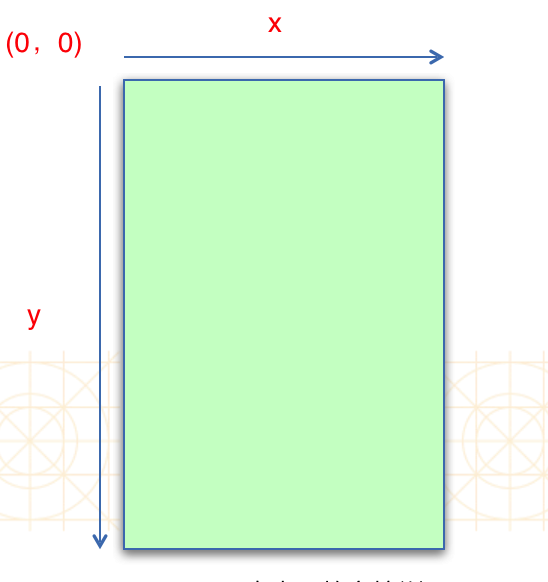
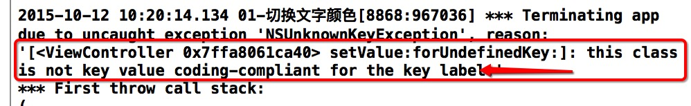
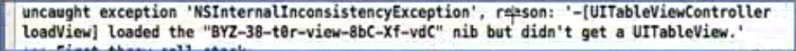
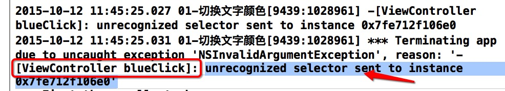

# _**StoryBoard UIView**_

** CG??Make() CG??GetMax?** CGRectContainsPoint(btn.frame, point)

## StoryBoard
```
//从xib或storyboard加载控件，只调用一次
- (void)awakeFromNib
```

  `UIView可以称之为控件/视图,所有能看的东西都是UIView`
  - UIKit坐标系，frame和bounds都是抽象的描述，前者描述可视范围，withframe就是控件初始化在可视范围内。其实这2个抽象都是无限大。bounds描述可视范围和内容范围的关系，内容范围不动，可视范围移动bounds.origin.y+10表示可视范围相对于内容范围向下走了10.
     
    
- IB Interface Builder

 - `IBAction相当于Void` 按钮之类的连线才可以加这个

 - `只有属性前加IBOutlet才能连线` ，有时候需要写完之后连线，非常特殊，比如改变事件响应者，需要在某个view中进行连线，那这时候command鼠标就不能完成了，需要手写了。


- `在storyboard中只有UIView是可以在里面拖入子控件的,其他控件不可以(storyboard中能看到UIView的视图层级关系，其他控件则不行,(必须通过代码addsubview添加))`

 - **_storyboard中command＋enter or option切换storyboard界面_**
 - **_ 判断一个对象是否能连线方法: 该对象的类是否继承于UIControl_**

 - **常见故事板连线错误
**    
    
     
    

## UIView
- 常用方法
  - `请进入UIView查看对应方法`

```obj
- (void)addSubview:(UIView *)view; 添加一个子控件view
- (void)removeFromSuperview; 从父控件中移除
/** 根据一个tag标识找出对应的控件（一般都是子控件） */
- (UIView *)viewWithTag:(NSInteger)tag; 
```
- 重写`-layoutSubviews`方法
  - 一定要调用`[super layoutSubviews]`
  - 在这个方法中计算和设置所有子控件的frame

`(CGRect){{,}{,}}相当于CGMake`,frame后面的点语法.不是getset方法了，是c语言的语法，所以不能单独赋值。

```obj
- (void)layoutSubviews{
    [super layoutSubviews];
 // ......}

```


```
//作用:去寻找最适合的View
//什么时候调用:什么时候用调用:只要一个事件,传递给一个控件时, 就会调用这个控件的hitTest方法
//返回值:返回的是谁,谁就是最适合的View(就会调用最适合的View的touch方法)
-(UIView *)hitTest:(CGPoint)point withEvent:(UIEvent *)event{
 //1.判断自己能否接收事件
 if(self.userInteractionEnabled == NO || self.hidden == YES || self.alpha <= 0.01) {
     return nil;
 }

 //2.判断当前点在不在当前View.
 if (![self pointInside:point withEvent:event]) {
     return nil;
 }

 //3.从后往前遍历自己的子控件.让子控件重复前两步操作,(把事件传递给,让子控件调用hitTest)
 int count = (int)self.subviews.count;
 for (int i = count - 1; i >= 0; i--) {

 //取出每一个子控件
 UIView *chileV = self.subviews[i];
 //把当前的点转换成子控件从标系上的点.
 CGPoint childP = [self convertPoint:point toView:chileV];
 UIView *fitView = [chileV hitTest:childP withEvent:event];
 //判断有没有找到最适合的View
 if(fitView){
     return fitView;
  }
 }
 //4.没有找到比它自己更适合的View.那么它自己就是最适合的View
 return self;
}

//作用:判断当前点在不在方法调用者身上,(谁调用pointInside,这个View就是谁)
//什么时候调用:它是在hitTest方法当中调用的.
//注意:point点必须得要跟它方法调用者在同一个坐标系里面
-(BOOL)pointInside:(CGPoint)point withEvent:(UIEvent *)event{

 NSLog(@"%s",__func__);

 return [super pointInside:point withEvent:event];

}

```
